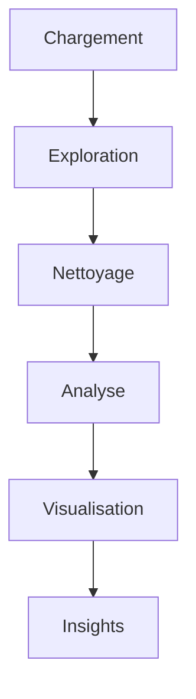

# 🛍️ TrendZone — Data Analysis Project

<p align="center">
  
  
  
  
  
</p>

---

## 📊 Contexte

Dans ce projet, j’endosse le rôle de **Data Analyst** pour une boutique fictive de mode : **TrendZone**.
L’objectif est d’analyser les données de ventes afin d’identifier des leviers de performance pour l’année **2026**.

---

## 🎯 Objectifs du projet

✔️ Nettoyer un dataset imparfait
✔️ Explorer et comprendre les données
✔️ Produire des visualisations impactantes
✔️ Générer des insights business exploitables

---

## 📁 Structure du projet

```bash
├── analyse.ipynb
├── bases.ipynb
├── exercice3.ipynb
├── miniprojet.ipynb   # 📌 Notebook principal
├── README.md
├── ventes_trendzone.csv
└── ventes_trendzone_corrige.csv
```

---

## 🧾 Dataset

📄 **500 transactions simulées**

| Variable       | Description                            |
| -------------- | -------------------------------------- |
| transaction_id | Identifiant unique                     |
| date           | Date de vente                          |
| produit        | Produit vendu                          |
| categorie      | Hauts / Bas / Chaussures / Accessoires |
| quantite       | Volume vendu                           |
| prix_unitaire  | Prix (€)                               |
| remise_pct     | Remise (%)                             |
| vendeur        | Vendeur                                |
| region         | Paris / Lyon / Bordeaux / Lille        |
| client_age     | Âge client                             |
| client_genre   | H / F / NR                             |

---

## ⚠️ Data Quality Issues

Le dataset contient volontairement des erreurs :

- ❌ Valeurs manquantes (~8%)
- 🔁 Doublons
- 💸 Prix négatifs
- 🚫 Quantité nulle
- 📅 Dates incohérentes

👉 Étape clé : **Data Cleaning**

---

## 🔍 Workflow



---

## 📈 Analyses réalisées

- 💰 Chiffre d’affaires global
- 🛍️ Performance par catégorie
- 🌍 Analyse régionale
- 👨‍💼 Performance des vendeurs
- 📊 Segmentation clients

---

## 📊 Exemple de visualisation

<p align="center">
  
</p>

---

## 🧠 Insights clés

- 👟 Les **Chaussures** génèrent le plus de chiffre d’affaires
- 👕 Forte demande sur les **Hauts**
- 📉 Les **Bas** sont les moins performants
- 🌍 Certaines régions surperforment → opportunités d’expansion

---

## 🛠️ Stack technique

- 🐍 Python
- 📊 pandas
- 📉 matplotlib
- 🎨 seaborn
- 📓 Jupyter Notebook

---

## 🚀 Installation

```bash
git clone https://github.com/ton-repo/trendzone-analysis.git
cd trendzone-analysis
pip install pandas matplotlib seaborn
jupyter notebook
```

---

## 📦 Livrables

- 📘 Notebook complet et commenté
- 📊 Visualisations
- 📝 Rapport synthétique (1 page)
- 🎤 Présentation orale

---

## 💼 Compétences démontrées

- Data Cleaning
- Data Visualization
- Exploratory Data Analysis (EDA)
- Storytelling avec la donnée
- Esprit analytique

---

## 📌 Conclusion

Ce projet met en évidence l’importance :

- de la qualité des données
- d’une analyse rigoureuse
- de visualisations claires pour la prise de décision

---

## 👤 Auteur

👨‍💻 Projet réalisé dans le cadre d’un apprentissage en Data Analysis
📅 2025

---

## ⭐ Bonus

👉 N’hésite pas à fork ce projet ou à t’en inspirer pour ton portfolio !

---
